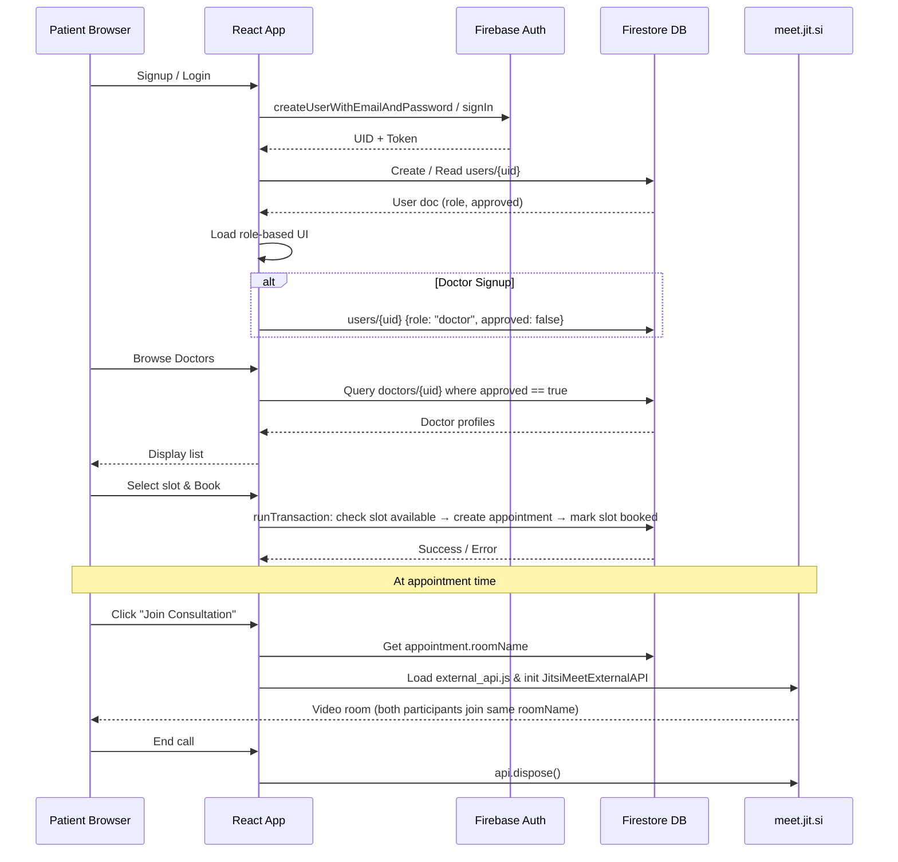
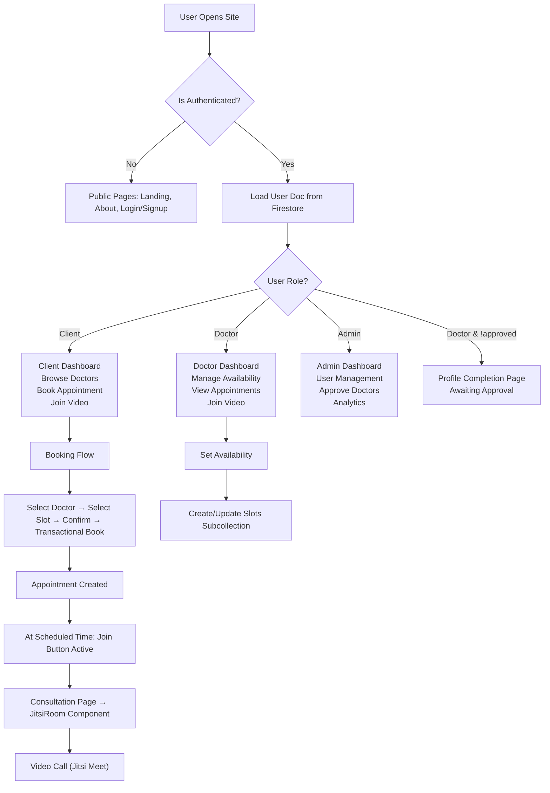
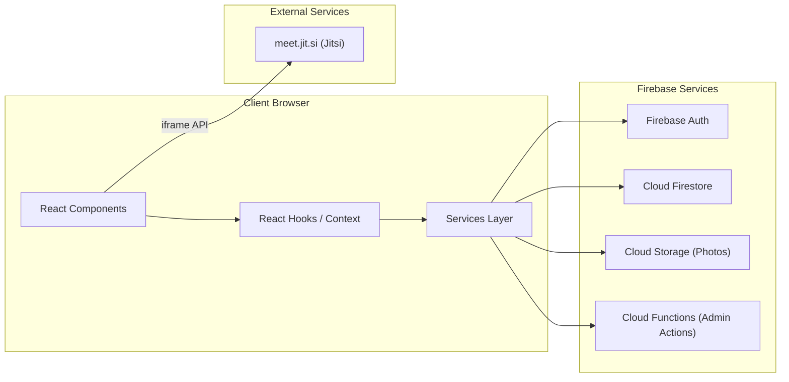
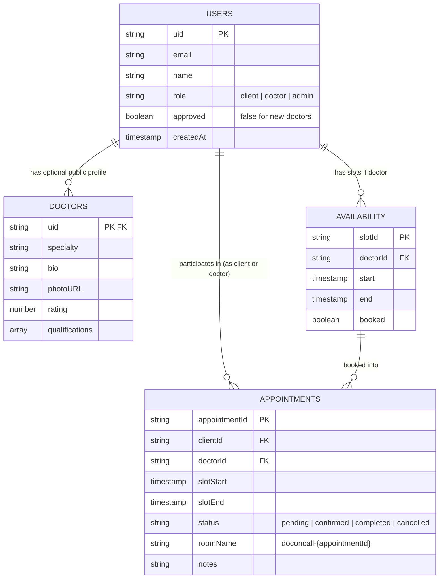
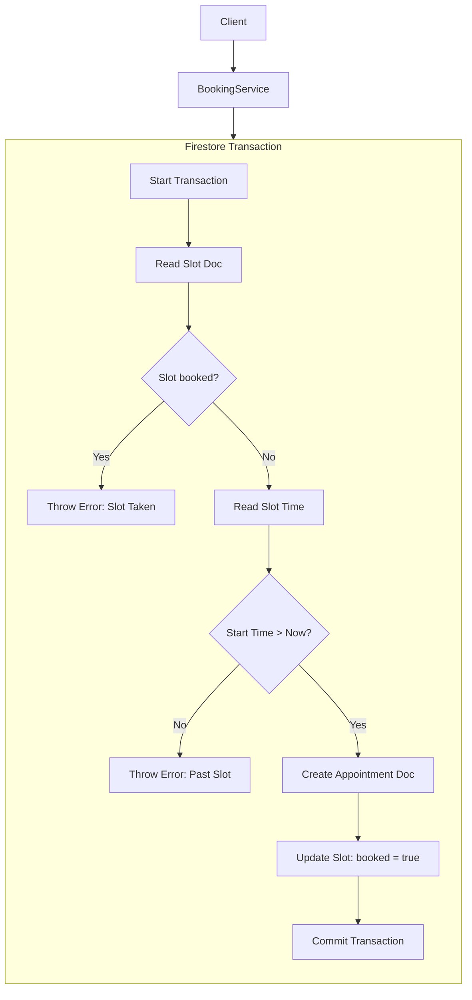
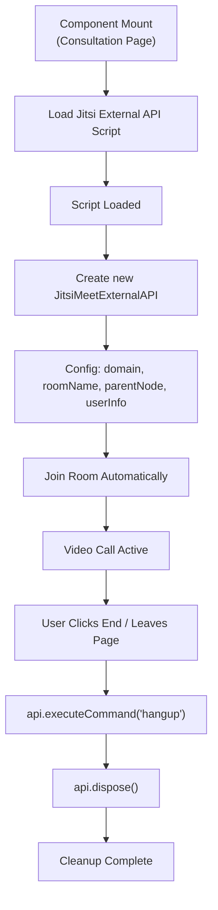
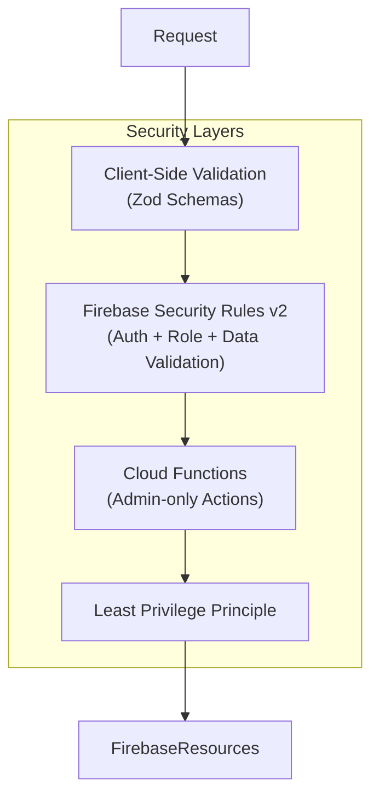

```mermaid
classDiagram
    direction TB

    namespace App {
        class AppProviders {
            <<Provider>>
            +AuthProvider
            +ThemeProvider
        }
        class RootLayout {
            +Header
            +Footer
            +Outlet
        }
        class Routes {
            +PublicRoutes
            +ProtectedRoutes
            +RoleBasedRoutes
        }
    }

    namespace Auth {
        class AuthContext
        class AuthService
        class LoginForm
        class SignupForm
        class RoleSelectionDialog
        class ProtectedRoute
    }
    
    namespace Profile {
        class ProfileService
        class ProfileForm
        class DoctorProfileCard
    }
    
    namespace Availability {
        class AvailabilityService
        class AvailabilityCalendar
    }
    
    namespace Booking {
        class BookingService
        class DoctorsList
        class SlotSelector
        class BookingWizard
    }
    
    namespace Video {
        class JitsiRoom
        class VideoControls
    }
    
    namespace Dashboard {
        class ClientDashboard
        class DoctorDashboard
    }
    
    namespace Admin {
        class AdminDashboard
        class UserManagementTable
        class AdminService
    }

    namespace Lib {
        class FirebaseInit {
            +getApp()
            +getAuth()
            +getFirestore()
            +getStorage()
        }
        class FirebaseService {
            <<interface>>
            +authOperations
            +firestoreOperations
        }
    }

    AppProviders --> AuthContext
    Routes --> ProtectedRoute
    AuthService ..|> FirebaseService
    ProfileService ..|> FirebaseService
    AvailabilityService ..|> FirebaseService
    BookingService ..|> FirebaseService
    AdminService ..|> FirebaseService

    LoginForm --> AuthService
    SignupForm --> AuthService
    RoleSelectionDialog --> AuthService
    ProfileForm --> ProfileService
    AvailabilityCalendar --> AvailabilityService
    DoctorsList --> BookingService
    SlotSelector --> BookingService
    JitsiRoom --> BookingService : gets roomName
    ClientDashboard --> BookingService
    DoctorDashboard --> BookingService
    AdminDashboard --> AdminService
```

```mermaid
sequenceDiagram
    participant Client as Patient Browser
    participant Frontend as React App
    participant FirebaseAuth as Firebase Auth
    participant Firestore as Firestore DB
    participant Jitsi as meet.jit.si

    Client->>Frontend: Signup / Login
    Frontend->>FirebaseAuth: createUserWithEmailAndPassword / signIn
    FirebaseAuth-->>Frontend: UID + Token
    Frontend->>Firestore: Create / Read users/{uid}
    Firestore-->>Frontend: User doc (role, approved)
    Frontend->>Frontend: Load role-based UI

    alt Doctor Signup
        Frontend->>Firestore: users/{uid} {role: "doctor", approved: false}
    end

    Client->>Frontend: Browse Doctors
    Frontend->>Firestore: Query doctors/{uid} where approved == true
    Firestore-->>Frontend: Doctor profiles
    Frontend-->>Client: Display list

    Client->>Frontend: Select slot & Book
    Frontend->>Firestore: runTransaction: check slot available → create appointment → mark slot booked
    Firestore-->>Frontend: Success / Error

    Note over Client,Jitsi: At appointment time
    Client->>Frontend: Click "Join Consultation"
    Frontend->>Firestore: Get appointment.roomName
    Frontend->>Jitsi: Load external_api.js & init JitsiMeetExternalAPI
    Jitsi-->>Client: Video room (both participants join same roomName)

    Client->>Frontend: End call
    Frontend->>Jitsi: api.dispose()
```

```mermaid
flowchart TD
    A[User Opens Site] --> B{Is Authenticated?}
    B -->|No| C[Public Pages: Landing, About, Login/Signup]
    B -->|Yes| D[Load User Doc from Firestore]
    D --> E{User Role?}
    E -->|Client| F[Client Dashboard<br/>Browse Doctors<br/>Book Appointment<br/>Join Video]
    E -->|Doctor| G[Doctor Dashboard<br/>Manage Availability<br/>View Appointments<br/>Join Video]
    E -->|Admin| H[Admin Dashboard<br/>User Management<br/>Approve Doctors<br/>Analytics]
    E -->|Doctor & !approved| I[Profile Completion Page<br/>Awaiting Approval]

    F --> J[Booking Flow]
    J --> K[Select Doctor → Select Slot → Confirm → Transactional Book]
    K --> L[Appointment Created]

    G --> M[Set Availability]
    M --> N[Create/Update Slots Subcollection]

    L --> O[At Scheduled Time: Join Button Active]
    O --> P[Consultation Page → JitsiRoom Component]
    P --> Q["Video Call (Jitsi Meet)"]
```

```mermaid
flowchart LR
    subgraph ClientBrowser [Client Browser]
        A[React Components]
        B[React Hooks / Context]
        C[Services Layer]
    end

    subgraph Firebase [Firebase Services]
        D[Firebase Auth]
        E[Cloud Firestore]
        F["Cloud Storage (Photos)"]
        G["Cloud Functions (Admin Actions)"]
    end

    subgraph External [External Services]
        H["meet.jit.si (Jitsi)"]
    end

    A --> B
    B --> C
    C --> D
    C --> E
    C --> F
    C --> G
    A -->|iframe API| H
```

```mermaid
erDiagram
    USERS ||--o{ DOCTORS : "has optional public profile"
    USERS ||--o{ AVAILABILITY : "has slots if doctor"
    USERS ||--o{ APPOINTMENTS : "participates in (as client or doctor)"
    AVAILABILITY ||--o{ APPOINTMENTS : "booked into"

    USERS {
        string uid PK
        string email
        string name
        string role "client | doctor | admin"
        boolean approved "false for new doctors"
        timestamp createdAt
    }

    DOCTORS {
        string uid PK,FK
        string specialty
        string bio
        string photoURL
        number rating
        array qualifications
    }

    AVAILABILITY {
        string slotId PK
        string doctorId FK
        timestamp start
        timestamp end
        boolean booked
    }

    APPOINTMENTS {
        string appointmentId PK
        string clientId FK
        string doctorId FK
        timestamp slotStart
        timestamp slotEnd
        string status "pending | confirmed | completed | cancelled"
        string roomName "doconcall-{appointmentId}"
        string notes
    }
```

```mermaid
flowchart TD
    subgraph BookingTransaction [Firestore Transaction]
        direction TB
        A[Start Transaction] --> B[Read Slot Doc]
        B --> C{Slot booked?}
        C -->|Yes| D[Throw Error: Slot Taken]
        C -->|No| E[Read Slot Time]
        E --> F{Start Time > Now?}
        F -->|No| G[Throw Error: Past Slot]
        F -->|Yes| H[Create Appointment Doc]
        H --> I[Update Slot: booked = true]
        I --> J[Commit Transaction]
    end

    Client --> BookingService --> BookingTransaction
```

```mermaid
flowchart TD
    A["Component Mount<br/>(Consultation Page)"] --> B[Load Jitsi External API Script]
    B --> C[Script Loaded]
    C --> D[Create new JitsiMeetExternalAPI]
    D --> E["Config: domain, roomName, parentNode, userInfo"]
    E --> F[Join Room Automatically]
    F --> G[Video Call Active]

    G --> H[User Clicks End / Leaves Page]
    H --> I["api.executeCommand('hangup')"]
    I --> J["api.dispose()"]
    J --> K[Cleanup Complete]
```

```mermaid
flowchart TB
    subgraph SecurityLayers [Security Layers]
        direction TB
        A["Client-Side Validation<br/>(Zod Schemas)"]
        B["Firebase Security Rules v2<br/>(Auth + Role + Data Validation)"]
        C["Cloud Functions<br/>(Admin-only Actions)"]
        D[Least Privilege Principle]
    end

    Request --> A --> B --> C --> D --> FirebaseResources
```
